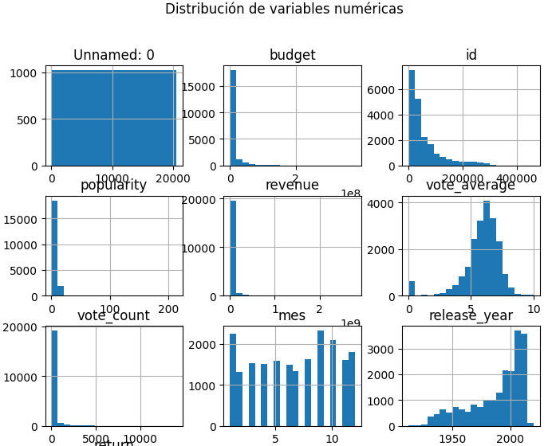
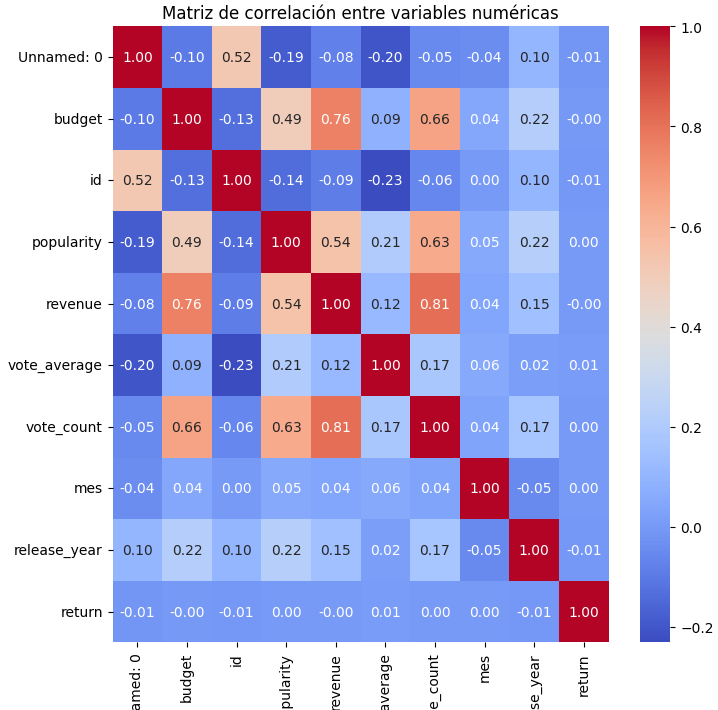
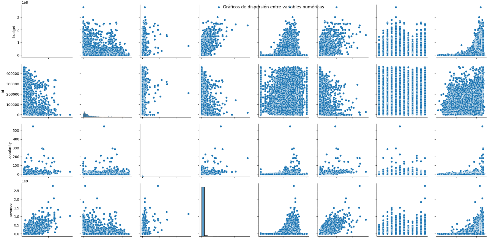
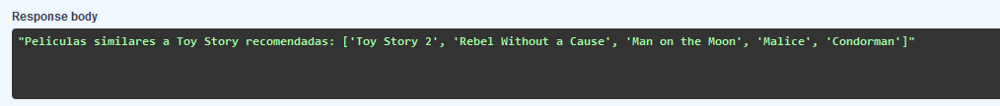
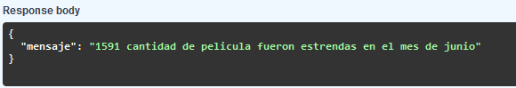
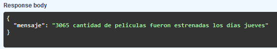
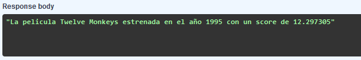
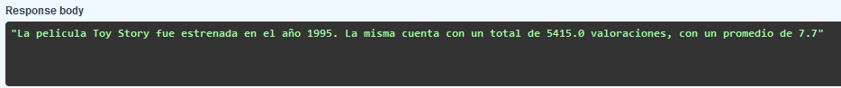
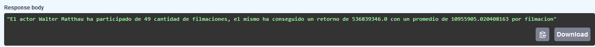
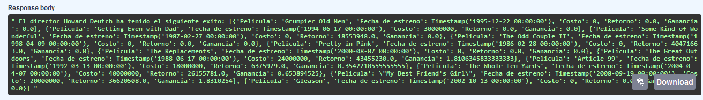

# Sistema de Recomendación de Películas

Este proyecto consiste en la construcción de un sistema de recomendación de películas mediante el cálculo de la similitud del coseno entre vectores de características, utilizando Python, Pandas y una API desarrollada con FastAPI para disponibilizar los datos que posteriormente seran desplegados en Render.

## Descripción del Proyecto

### 1. Preparación y Reducción del Dataset
Para optimizar el procesamiento y consumo de los datos, se han realizado los siguientes pasos:

- **Unificación de Datasets**: Se integraron los datasets `movies_dataset` y `credits`, combinando las características necesarias en un solo dataset consolidado de nombre `dataset`.
- **Reducción de Tamaño**: El dataset final fue reducido a un tamaño de 25 MB (aproxidamente), seleccionando únicamente las columnas relevantes para las congisnas y el modelo de recomendación.
- **Análisis Exploratorio de Datos (EDA)**: Realizamos un análisis exploratorio para comprender la estructura y las propiedades del dataset.
- **Despliegue(Render)**: Se realizo el despligue de la api en la plataforma de Render

#### Análisis Exploratorio de Datos (EDA)
- **Dimensiones y Tipos de Datos**: Identificamos las dimensiones del dataset final `(28771 , 20)` y los tipos de datos de cada columna: `Int64` , `float64`, `object`.
- **Análisis Estadístico**: Exploramos las estadísticas descriptivas de las variables numéricas (por ejemplo, valores promedio, mínimos y máximos, deviación estandar, ect).
- **Valores Únicos y Nulos**: Se analizaron las columnas para detectar valores únicos y se trató la presencia de valores nulos.
- **Filas Duplicadas**: Se analizo la cantidad de filas duplicadas para asegurar la integridad de los datos.
- **Distribución y Correlación**: Se analizaron las distribuciones de las variables numéricas y se generó un mapa de calor para visualizar la correlación entre variables.

###Resultado de distribucion de variables

  

###Resultado del analisis en mapa de calor

  

###Resultado correlación entre variables
  

  
### 2. Sistema de Recomendación Basado en Similitud del Coseno
Utilizamos la similitud del coseno para medir la relación entre películas y proporcionar recomendaciones. A partir de las características de cada película (como género, actores principales y director), el sistema calcula la similitud y recomienda películas que tengan un perfil similar al de la película consultada.

#### Resultado del sistema de recomendacion

 

### 3. Desarrollo de API con FastAPI
Implementamos una API con FastAPI que permite acceder a diferentes consultas y funciones del sistema. La API cuenta con seis endpoints, cada uno de ellos expuesto mediante un decorador `@app.get('/')` para responder a las consultas.

#### Endpoints de la API
1. **`cantidad_filmaciones_mes(Mes)`**: Retorna la cantidad de películas estrenadas en el mes especificado en español.
#### Ejemplo de resultado
 
  
2. **`cantidad_filmaciones_dia(Dia)`**: Retorna la cantidad de películas estrenadas en el día de la semana especificado en español.

 
   
3. **`score_titulo(titulo_de_la_filmación)`**: Dado el título de una película, devuelve el título, el año de estreno y el puntaje de popularidad.

 

4. **`votos_titulo(titulo_de_la_filmación)`**: Dado el título de una película, devuelve el título, la cantidad de votos y el promedio de votos, siempre que haya al menos 2000 valoraciones.

 

5. **`get_actor(nombre_actor)`**: Dado el nombre de un actor, devuelve la cantidad de películas en las que ha participado, su retorno total y el promedio de retorno.

 
   
6. **`get_director(nombre_director)`**: Dado el nombre de un director, devuelve el éxito medido en términos de retorno, junto con el nombre de cada película, su fecha de lanzamiento, retorno individual, costo y ganancia.

 

